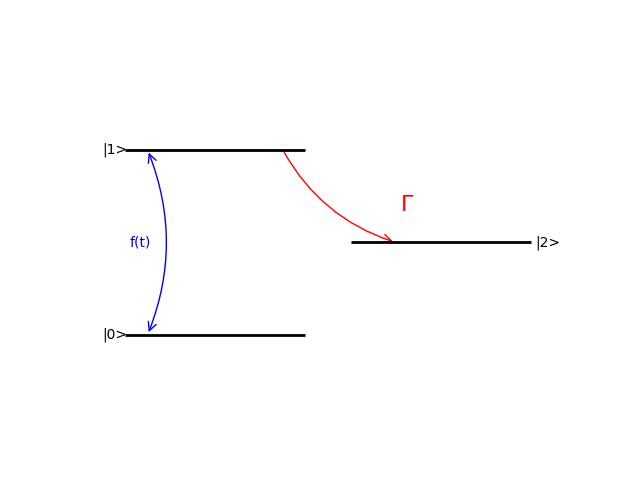
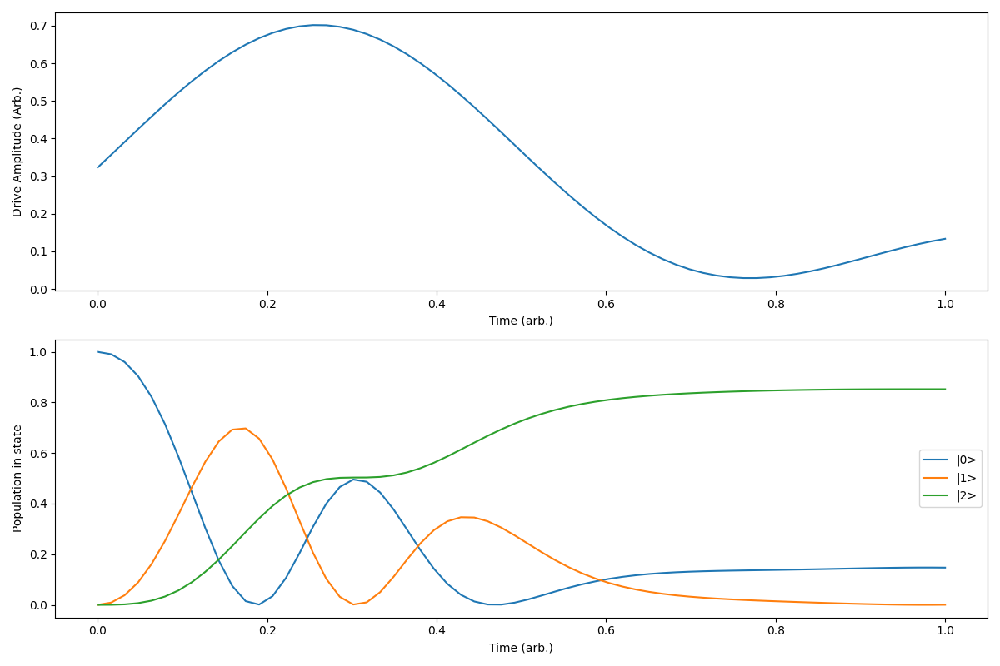
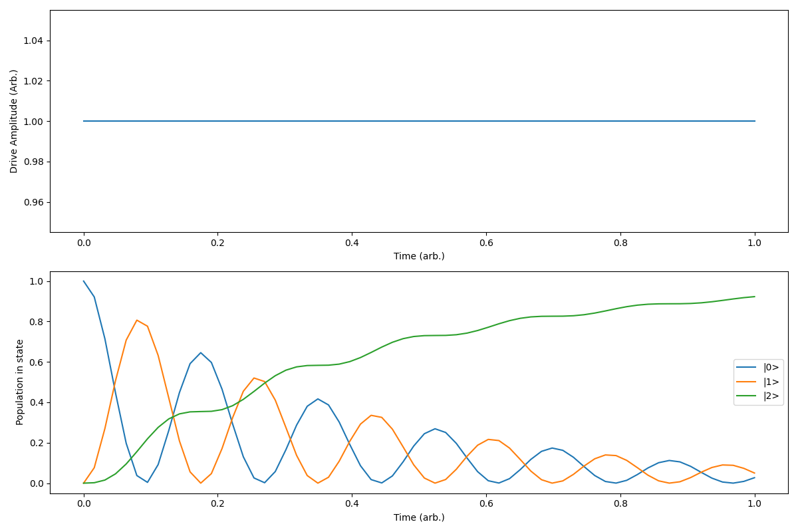
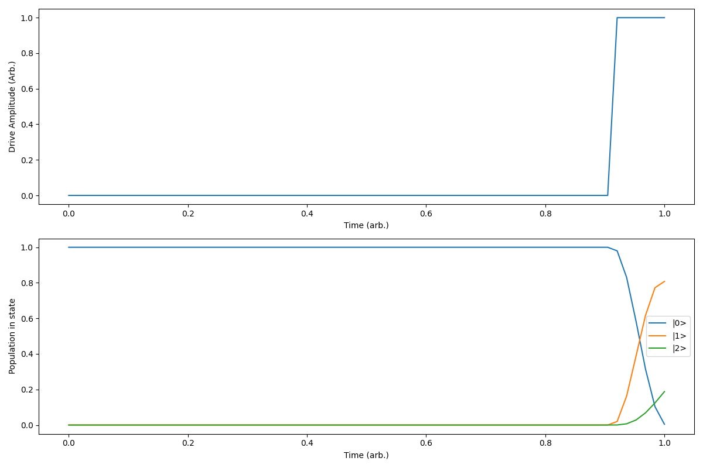
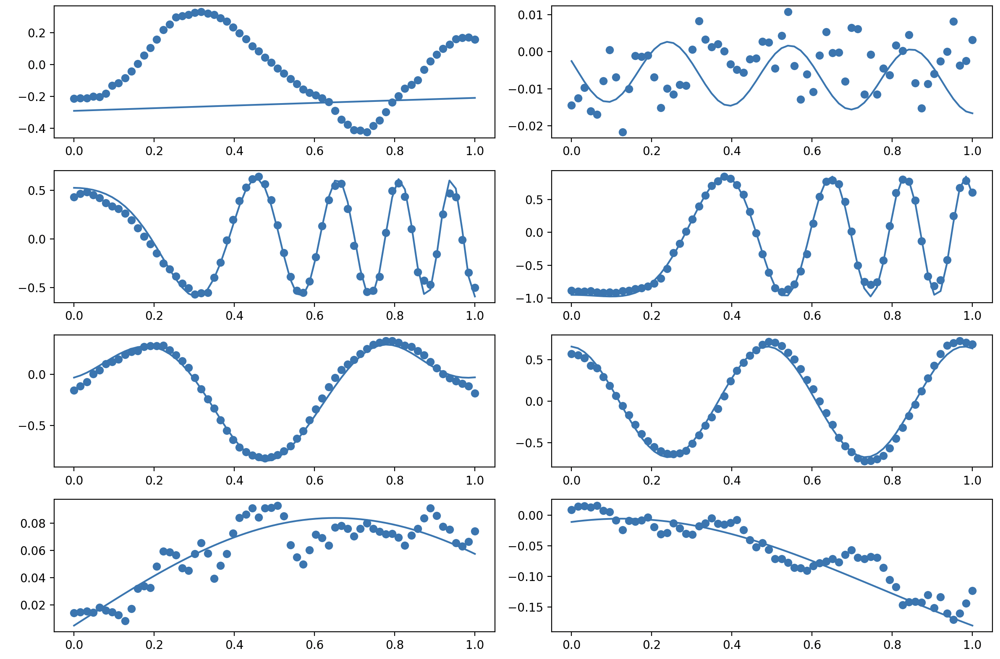
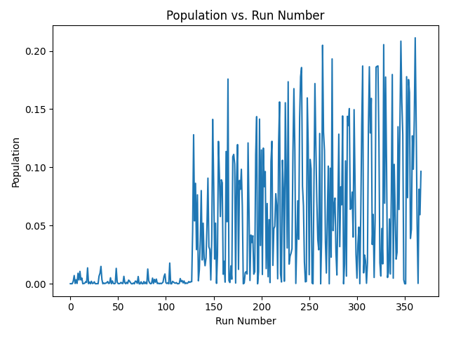

# Introduction
  In neutral atom experiments, many experimental system parameters often cannot be analytically modeled well enough to simulate the resulting atom dynamics and predict optimal control sequences (for example, the optimal pulse profile to prepare an atom in a state given laser noise, drifting parameters, etc.). In an attempt to solve this problem, this repository implements Variational AutoEncoder (VAE) Quantum Optimizer for use in real-time quantum experiments involving neutral atoms. It utilizes the latent space of a VAE to optimize a discretely-sampled series of parameters for achieving a desired outcome.
 
  There are many difficulties to overcome in attempting to optimize neutral atom experiments:
  1. Experiments are subject to drifting parameters over the timescale of ~1 hour due to factors such as sensitive laser alignment
  2. The cycle rate is often slow (~1 data point/second), leading to small sample sizes
  3. Small sample sizes then lead to overfitting and mode collapse
  4. Measurement during the sequence often affects the state of the system, which leads to difficulty in extracting information from a trial (except at the end of the sequence)
  5. Parameters spaces are often very sparse, with only a tiny subset of the space providing enough signal to get meaningful information. For example, most combinations of parameter choices will eject atoms from the system

  This code implements a toy model example of a driven three-level system with states |0>, |1> with a decay rate out of the two-level system to state |2>. The driven two-level system has the simple Hamiltonian: $$H = f(t) \sigma _x$$ that evolves under the  collapse operator $$\sqrt \Gamma \ |2><1|.$$ Because most random functions will have far more population on average in |0> or |2> than |1>, this serves as a good testbed for applications to real-world experiments with sparse landscapes

  
# VAE Quantum Optimizer 
 This repository is a framework for solving this problem of optimizing neutral atom experiments. The basic idea is:
 1. Encode into a VAE latent space what a "reasonable" function for optimizing a sequence may look like. This teaches the VAE how to represent functions such as Gaussians, Sines, Sincs, Lines, Exponentials, and superpositions of these in a lower dimensional space that can be more easily searched over than the full input space. Specifically, these functions are sampled at 64 points and encoded into an 8-dimensional latent space. If there is prior knowledge about the problem, the VAE could be fine-tuned to represent certain function classes such as wavelets. The code to do this is contained in 4 files:
    - data_generator.py creates superpositions of random functions and runs them through the three-level qutip simulation to predict the populations in state |1> (in our three-level system with states |0>, |1> with decay to a third level |2>)   
    - generate_pickle_samples.py creates a large number of function/population pairs to be used for training
    - train_VAE.py trains the VAE on the generated samples. Image below of random functions (solid) and VAE reconstructions (dotted). I prioritized a large beta value to make the latent space smoother for later gradient descent optimization, so the reconstructions are not always close.
    
    - VAE_optimizer_architecture.py houses the VAE and predictor network to predict populations
 2. Interface a predictor network contained in the VAE_optimizer_architecture.py with the VAE, and train it to predict whether a given point in the latent space will result in a high population in state |1>. The train sample size is 128, and after initial training on this dataset, new data points are predicted that ideally maximize the population in state |1>. The new measurements are then fed back into the model to update the parameters, and predict new points. There are many techniques applied to prevent from collapsing  always predicting the set of points while also biasing it towards points that have performed well in previous updates. What follows is a summary of some of the key points and ideas in the prediction network
    - For new point prediction, gradient descent is performed on the predictor network to find values in the latent space that maximize the population in state |1>
    - Each cycle of prediction has 8 total starting points. 4 of the points are chosen to be at previous latent space values that performed well and 4 of the points are chosen randomly. Gradient descent is applied to find the prediction network's best guess for which of the values will work best.
    - A penalty is added during gradient descent that adds a cost to picking  points too close to previous previous points in the cycle. The penalty decreases with distance in the 8-dimensional latent space
    - gelu activations are used to have smoother gradients, regularization/dropout are applied to prevent overfitting to the small dataset
    - Since the data is sparse (most data points will perform poorly) and the we care more about the points that produce high |1> populations, sample weighting is applied to weight higher in training values that produce larger populations
    - There is a large degree of variation that helps prevent overfitting that arises from the fact that the latent space is sampled from a distribution. This additionally helps overfitting
    
    
# Results

The model is trained on 128 training samples that are randomly obtained by sampling from the latent space. The average fraction of population in state |1> is roughly ~0.0050 from sampling many seeds, with a max of typically betweeon 0.01 and 0.03. After initially learning the population landscape as a function of the latent space, new points are predicted. A plot of this is shown below for a representative random seed. 

Notably, there is a huge jump in the population at the first guessed point, which can sometimes be orders of magnitude larger than what was in the training set (the training set is first 128 points in the plot). It then improves upon the initial result by roughly a factor of two within a small number iterations. Also notable is that this is a problem that is poorly-suited for a VAE yet still achieves a hugely improved result over the training set: the output function is ideally flat and then rapidly increases at the end of the input QuTiP sequence to maximize population in |1>. Such sequence are difficult for convolutional neural networks to learn, yet it still reach a factor of less than 4 from the maximum achievable population in |1> that can be calculated analytically using krotov's method (https://qucontrol.github.io/krotov/v1.1.0/07_krotovs_method.html). Krotov's method, however, doesn't work for real experimental systems that have noise and systematics that are difficult or impossible to model

# TODO
- Extend to multiple variables
- Scale the population inputs for training data into the predictor network
- Improve predictor network fitting fidelity. It seems to sometimes divide points into either good or bad by putting their predicted value near 0 or at some other value, with small variations in between good or bad values.